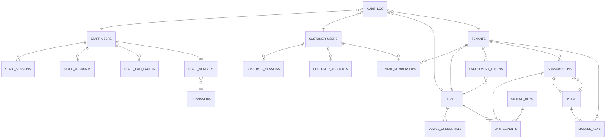

# CloudBox Architecture

CloudBox is a managed SaaS appliance platform: a physical Windows PC becomes a centrally licensed, privately networked, remotely accessible, backed-up, self-updating business application server. The architecture spans four deployment zones and enforces strict boundaries between identity systems, staff authorization, and customer tenancy.

## Deployment zones

1. **Cloud SaaS** — Cloudflare Workers (HTTP), D1 database, Durable Objects, R2 storage, Email Service.
2. **Network control plane** — Self-hosted WireGuard orchestration (NetBird management and signal servers) on customer VPS.
3. **CloudBox Server endpoint** — Windows machine running Agent, Status, RDP concurrency runtime, private-network runtime, backup and update workers.
4. **CloudBox Connect endpoint** — Employee Windows client: tenant-scoped sign-in and one-click private RDP access.

## Trust boundaries

- Cloud business authority does not live solely in the VPN controller; state is authoritative in D1.
- Windows privileged actions (install, uninstall, update, device revocation) go through the Agent.
- Customer UIs see CloudBox concepts, not upstream VPN/RDP implementation details.
- API contract begins at `/api/v1/*`. Production origin is `https://box.affinity.ai.in`.
- Staff operations run on the separate `/api/ops/*` base path with their own authentication and authorization layer.

## Identity systems (ADR 0002)

Two completely separate identity tables, no shared records or credentials:

### Staff identity (`/api/ops/auth`)
- `staff_users` — Staff account records.
- `staff_sessions` — Token and expiry; IP/user-agent logging.
- `staff_accounts` — OAuth/credential provider links (password + two-factor secrets).
- `staff_verifications` — OTP codes and expiry (email address verification in staff onboarding).
- `staff_two_factor` — TOTP secrets and backup codes for staff 2FA.
- `staff_rate_limit` — Rate-limiting state (by key, e.g., email + IP).

Authentication: password (initial, must-change flag) + email OTP recovery + TOTP authenticator. Audited. Role-based access control is checked server-side on every request.

### Customer identity (`/api/auth`)
- `customer_users` — Customer account records.
- `customer_sessions` — Token and expiry; IP/user-agent logging.
- `customer_accounts` — OAuth/credential provider links.
- `customer_verifications` — OTP codes and expiry (email-OTP only).
- `customer_rate_limit` — Rate-limiting state (by key, e.g., email + IP).

Authentication: email-OTP only. No passwords. Codes are consumed atomically; resends reuse the existing code if still valid. 3 failed attempts burn the code.

### Better Auth
Both systems use Better Auth v1.7.6 with email-OTP plugin for customers (closed sign-up) and password + two-factor plugin for staff. Better Auth tables are generated by `pnpm auth:generate` from `src/auth/cli.ts` (staff) and `src/auth/cli-customer.ts` (customers). **Do not hand-edit these tables.**

## Staff authorization

- `staff_members` — Links `staff_users` to a role (`super_admin`, `admin`, `support`, `read_only`). Includes `mustChangePassword` flag (set until first password change after admin grant).
- `permissions` — Permission keys (e.g., `staff:read`, `device:revoke`).
- `role_permissions` — Map role → permission. Checked server-side on every protected operation.

Bootstrap: one `INSERT … SELECT … WHERE NOT EXISTS` grants the first email the `super_admin` role on first sign-in; all other grants are audited staff operations.

## Tenancy and membership

- `tenants` — Customer organizations. Fields: `id`, `publicCode` (sequential, user-facing identifier, public by design), `displayName`, `legalName`, `status` (trial/provisioning/active/past_due/suspended/cancelled/archived), primary/support/billing contact emails, timezone, maintenance window, renewal warning days, backup policy, subscription plan code, notes, audit timestamps.
- `tenant_memberships` — Customer-to-tenant mapping. Fields: `id`, `tenantId`, `userId` (customer user), `standing` (owner/admin/user), `status` (active/revoked), `invitedBy`, `createdAt`. Unique constraint on `(tenantId, userId)`.

Ownership: WT-2 makes the primary contact email the first Owner. That person must verify their email (OTP) to activate the membership. Tenants can have multiple Owners; only the last Owner cannot be demoted (checked server-side with a race-free conditional UPDATE).

## Plans and subscriptions

- `plans` — Product offerings. Fields: `code` (PK), `name`, `description`, `maxDevices`, `maxManagedUsers`, `featuresJson`, `offlineGraceDays`, `renewalWarningDays`, `status` (active/retired), `termDays` (365), `priceAmount` (minor units), `currency` (INR/USD/EUR/GBP/AED), `addonUserPriceAmount`, `maxAddonUsers`, audit timestamps. Managed by staff operations.

- `subscriptions` — Customer's active plan. Fields: `id`, `tenantId`, `planCode`, `status` (pending/trial/active/past_due/suspended/cancelled), `validFrom`, `validUntil` (both required after `pending`), `maxManagedUsers`, `addonUsers` (beyond plan base), `featuresJson`, `offlineGraceDays`, `renewalWarningDays`, audit timestamps. Unique constraint: one active/pending subscription per tenant per plan.

Lifecycle: staff assigns a plan to a tenant (subscription created in `pending` status, no dates); first device enrolls and auto-activates (dates filled in). License keys are optional: a tenant with a subscription and no keys uses the subscription's term directly.

## Devices and enrollment

- `devices` — Physical CloudBox machines. Fields: `id`, `tenantId`, `name`, `status` (enrolled/revoked/transferred), `devicePublicKeyJwk`, `deviceKeyThumbprint` (unique), `keyProtection` (tpm/software), `hostname`, `windowsBuild`, `agentVersion`, `lastSeenAt`, `lastHealthJson`, `enrolledAt`, `revokedAt`.

- `enrollment_tokens` — One-time enrollment codes issued by tenant Owners/Admins. Fields: `id`, `tenantId`, `tokenHash` (unique), `label`, `createdBy`, `expiresAt`, `redeemedAt`, `redeemedDeviceId`, `revokedAt`, `createdAt`. Agent installs on Windows, displays a code, user enters it into a web form, server verifies and issues a device key pair.

- `device_credentials` — Rotating tokens for agent heartbeats. Fields: `id`, `deviceId`, `tokenHash` (unique), `createdAt`, `revokedAt`. Issued at enrollment and rotated on every successful heartbeat.

## Licensing and entitlements

- `license_keys` — Offline-use keys, minted in batches by staff. Fields: `id`, `batchId` (groups one generation call), `codeHash` (SHA-256 hex, unique), `codeLast4` (support lookup), `planCode`, `batchLabel`, `status` (unredeemed/redeemed/revoked), `createdBy` (staff user id), `createdAt`, `expiresAt`, `redeemedAt`, `redeemedTenantId`, `redeemedByEmail`, `revokedAt`, `revokeReason`. Redeemed on first server activation; one key + server pair completes a subscription assignment offline.

- `entitlements` — Device-level licenses issued when a subscription is active. Fields: `id`, `subscriptionId`, `deviceId`, `generation` (incremented on revocation), `claimsJson` (allowed features, device count check, etc.), `token` (compact JWE, never logged), `issuedBy`, `issuedAt`, `validUntil`, `revokedAt`. Unique constraint on `(deviceId, generation)`. Auto-issued on device activation and on heartbeat if expired. Bound to the subscription's plan and term.

- `signing_keys` — KIDs for entitlement token signing. Fields: `kid`, `alg`, `publicJwk`, `status` (active/retired), `createdAt`. Stored in D1; public key deployed to all CloudBox machines for local offline verification.

## Email providers (ADR 0010)

- `email_providers` — Configurable delivery routes. Fields: `id`, `name`, `kind` (cloudflare_binding/smtp/log), `priority`, `enabled`, `fromAddress`, `configJson` (non-secret fields: host, port, secure, username for SMTP), `secretCiphertext`/`secretIv` (AES-256-GCM encrypted secrets), `updatedBy`, `createdAt`, `updatedAt`. Tried in priority order; first enabled provider wins. Bootstrap configures Cloudflare Email Service binding.

## Audit trail

- `audit_log` — Immutable append-only event log. Fields: `id`, `eventType` (AUTH_OTP_SENT, AUTH_LOGIN_SUCCEEDED, DEVICE_ENROLLED, LICENSE_ISSUED, etc.), `entityType`, `entityId`, `actorType` (staff_user/customer_user/service), `actorId`, `action`, `beforeJson`, `afterJson` (state deltas), `createdAt`, `actorTenantId` (tenant scope), `correlationId` (request trace), `source`. Indexed on `(createdAt)`, `(entityType, entityId, createdAt)`, `(actorTenantId, createdAt)`. Never deletable (trigger: `audit_log_no_delete`).

## Database schema (ER diagram)

## Request flows

### Installer onboarding (tenant self-service)

1. **Start** → Customer visits `https://box.affinity.ai.in/start` and enters email.
   - Turnstile verification required (P2-3: testing keys only in dev).
   - OTP sent (3 / 60 s per IP, 5 per email+IP per 15 min, 30 per email per hour, 10 per 24 h to new addresses).
   - Audit: `AUTH_OTP_SENT`.

2. **Verify email** → Customer enters OTP.
   - Code consumed atomically; 3 failed attempts burn it.
   - Creates or links customer user.
   - Audit: `AUTH_LOGIN_SUCCEEDED` or `AUTH_LOGIN_FAILED`.

3. **Create tenant** → Customer (now signed in) creates a tenant.
   - Mints sequential public code (e.g., CBX-00001), display name, legal name.
   - Tenant status set to `provisioning`.
   - Audit: `TENANT_CREATED`.
   - Tenant owner is the customer_user who created it (automatically added to memberships as `owner`).

4. **Get activation code** → Admin/Owner calls `POST /api/v1/tenants/{tenantId}/activation-grants`.
   - Generates one-time activation code, valid 7 days.
   - Mints enrollment token (device enrollment code).
   - Audit: `ENROLLMENT_TOKEN_CREATED`, `ACTIVATION_GRANT_CREATED`.
   - Server response includes `activationCode` for the server to display.

5. **Offline: Redeem activation code on server** → Installer runs on Windows, displays enrollment code.
   - Server stores enrollment code in local registry.
   - On first heartbeat, server calls `/api/v1/agent/enroll`.
   - Sends `activationCode` + `enrollmentCode` + public key.
   - Cloud validates: activation code matches enrollment token, device not already enrolled.
   - Audit: `DEVICE_ENROLLED`.
   - Cloud issues first entitlement (auto-activate subscription if pending, set dates).

6. **Online: Bind plan and issue license** → Admin optionally redeems a license key.
   - `POST /api/v1/licenses/redeem` with license code.
   - Key moved to `redeemed` status, linked to tenant.
   - Subscription updated with plan and term from the key's plan.
   - Audit: `LICENSE_KEY_REDEEMED`, `SUBSCRIPTION_ACTIVATED`.

### Connect sign-in

1. **Start** → Tenant member visits Connect client, is prompted to sign in.
   - Client sends `POST /api/auth/connect/send-code` with tenant public code + email.
   - Rate limited: 3 / 60 s per client IP per path.
   - Checks if email is a member of that tenant.
   - If yes (member): sends OTP via email in background (`waitUntil`), answers `{success:true}`.
   - If no (non-member): answers identical `{success:true}` (no timing leak).
   - Code validity: 10 minutes.
   - Audit: `AUTH_OTP_SENT` (members only).

2. **Verify code** → Client sends `POST /api/auth/connect/verify-code` with code.
   - Rate limited: 3 / 60 s per client IP per path.
   - For members: passed to Better Auth, consumed, returns session.
   - For non-members: Better Auth rejects; cloud re-serializes as `CONNECT_INVALID` (byte-exact).
   - Audit: `AUTH_LOGIN_SUCCEEDED` or `AUTH_LOGIN_FAILED` (members only).

3. **Access remote session** → Signed-in Connect client initiates RDP to the tenant's device via VPN.
   - VPN controller (NetBird) validates device membership in signed-in tenant.
   - Concurrent RDP sessions: RDP Wrapper embedded in Server.
   - Audit: per NetBird logs, not CloudBox audit log.

## Key technologies and decisions

- **Cloudflare Workers + D1:** Cloud API and SQLite database. Drizzle ORM for migrations and queries.
- **Better Auth v1.7.6:** Authentication primitives. Plugins: email-OTP (customers), password + TOTP (staff).
- **Hono:** HTTP framework for Workers.
- **NetBird v0.79.0:** Self-hosted WireGuard orchestration, REST API consumed by CloudBox.
- **RDP Wrapper v2.15 + TermWrap:** Concurrent RDP sessions on Windows (commercial license from author).
- **.NET 10:** Windows Agent, Server Setup, Connect, Status components.
- **Turnstile:** Cloudflare CAPTCHA (self-service flow enrollment protection).
- **Email Service:** Cloudflare managed transactional email (bootstrap provider).

## API versioning

- `/api/v1/*` — Versioned customer and device APIs.
- `/api/ops/*` — Staff operations, separate auth and authorization layer, unversioned within each endpoint.
- `/api/auth/*` — Identity and session management (email-OTP, sign-in, sign-out), unversioned within each endpoint.
- `/api/agent/*` — Device-to-cloud messaging (enroll, heartbeat, key rotation), device-bearer-token auth.
- `/api/health`, `/api/version` — Unversioned operational endpoints.

## Observability

- **Audit log:** Every consequential state change is recorded with before/after JSON, actor, entity, action, and tenant scope.
- **Request tracing:** Correlation ID minted server-side, sent to client as `X-Request-Id`.
- **Build version:** Stamped at deploy time (`BUILD_SHA`, `BUILD_TIME`).
- **Health checks:** `GET /api/health` returns 200 if D1 is reachable.
