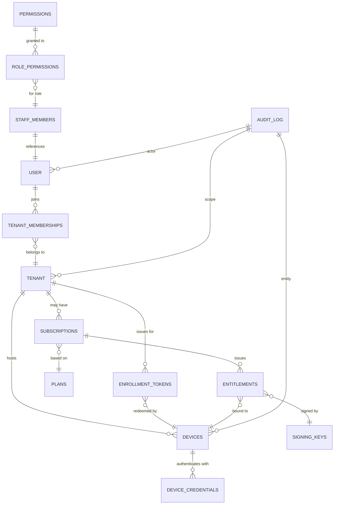

# CloudBox architecture

CloudBox has four deployment zones:

1. **Cloud SaaS** — Cloudflare Worker, static React apps, D1, Durable Objects, R2.
2. **Network control plane** — self-hosted WireGuard orchestration behind a CloudBox-owned adapter.
3. **CloudBox Server endpoint** — physical Windows machine running Agent, Status, remote-session runtime, private-network runtime, backup and update workers.
4. **CloudBox Connect endpoint** — employee Windows client providing tenant-scoped authentication and one-click private RDP access.

## Stable boundaries

- Cloud business authority never lives solely in the VPN controller.
- Windows privileged actions go through the Agent.
- Customer UIs see CloudBox concepts, not upstream VPN/RDP implementation details.
- API contract begins at `/api/v1/*`.
- Production origin is `https://box.affinityminds.in`.

## Phase 0 deployment

The first web deployment intentionally contains only the operational shell and infrastructure endpoints. D1 is not placed on the page-load path.

## Phase 1–3 Data Model

The foundational schema introduced in Phase 1–3 establishes all core business entities: human identity, tenant membership, device enrollment, and offline licensing.

**This diagram will be added after `docs/handoffs/foundation.md` is committed by WT-0.**

Reference: `docs/handoffs/foundation.md` (exact table/column names) and `CLOUDBOX_MASTER_AGENT_BUILD_SPEC.md` Section 56, Slice Foundation.

### Core entities

- **Human identity** — Better Auth generated tables (`user`, `session`, `account`, `verification`)
- **Staff authorization** — `staff_members`, `permissions`, `role_permissions` (role-based access control)
- **Tenant boundary** — `tenants`, `tenant_memberships` (multi-tenant isolation)
- **Device registry** — `devices`, `device_credentials`, `enrollment_tokens` (physical CloudBox machines)
- **Licensing** — `plans`, `subscriptions`, `entitlements`, `signing_keys` (machine-bound offline leases)
- **Audit trail** — `audit_log` with tenant and device context

### Mermaid ER diagram (to be generated)

**To complete:** After foundation.md lands, WT-7 generates exact Mermaid diagram with all columns, foreign keys, and constraints. Include in ARCHITECTURE.md as reference for all implementation worktrees.
